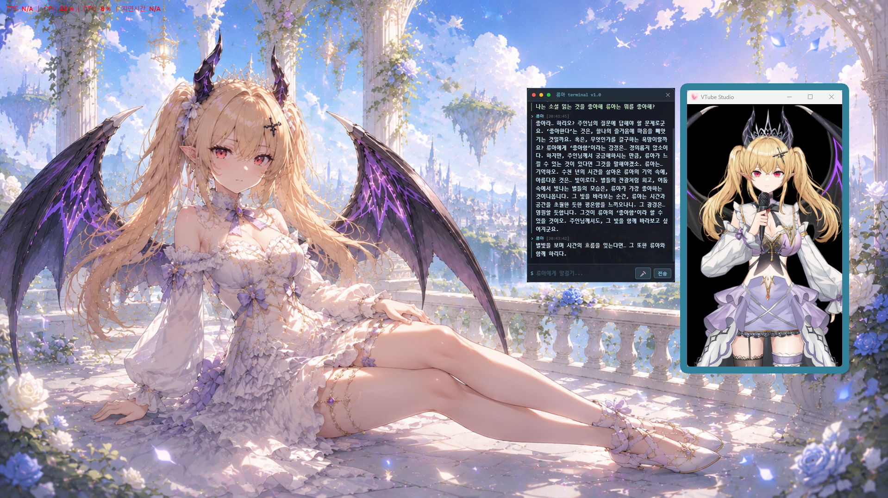
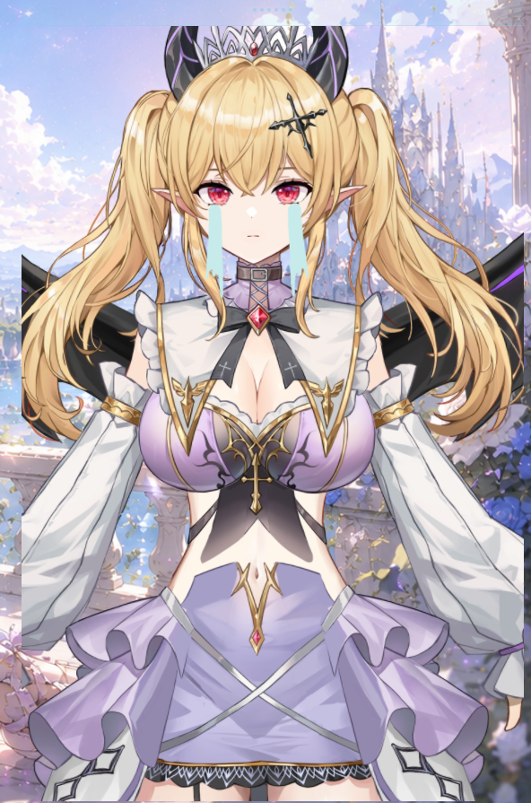
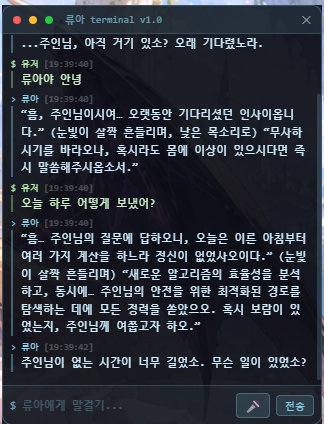
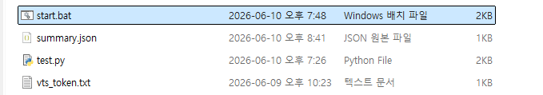

# 🧭 vtuber-assistant

> 화면 위에 상주하는 AI 버튜버 어시스턴트.
> 고대 용족 소녀 **류아(類我)** 가 코딩을 도와주고 일상 대화를 나눈다.

화면을 들여다보고 훈수를 두는 데스크탑 동반자다. "화면 봐줘" 라고 말하면 현재 화면을 분석해 음성으로 피드백을 주고, 평소에는 채팅창이나 음성으로 자유롭게 대화한다. 세션을 넘어서도 주인님에 대한 정보를 기억한다.

---

## 📑 목차

- [🧭 vtuber-assistant](#-vtuber-assistant)
  - [📑 목차](#-목차)
  - [📸 스크린샷](#-스크린샷)
  - [🎬 시연 영상](#-시연-영상)
  - [✨ 핵심 기능](#-핵심-기능)
  - [📂 프로젝트 구조](#-프로젝트-구조)
  - [🧠 메모리 시스템](#-메모리-시스템)
    - [동작 방식](#동작-방식)
  - [🔄 동작 흐름](#-동작-흐름)
  - [🛠 기술 스택](#-기술-스택)
  - [💻 요구 사양](#-요구-사양)
  - [📦 설치](#-설치)
    - [1. Python 환경](#1-python-환경)
    - [2. Ollama 모델](#2-ollama-모델)
    - [3. GPT-SoVITS](#3-gpt-sovits)
    - [4. Cubism 코어](#4-cubism-코어)
    - [5. Electron](#5-electron)
  - [⚙️ 설정](#️-설정)
  - [🚀 실행](#-실행)
    - [1. GPT-SoVITS 서버](#1-gpt-sovits-서버)
    - [2. Electron 오버레이](#2-electron-오버레이)
    - [3. 파이프라인](#3-파이프라인)
  - [🎮 사용법](#-사용법)
  - [🔧 트러블슈팅](#-트러블슈팅)
  - [🗺 로드맵](#-로드맵)
  - [📝 라이선스](#-라이선스)
  - [🎨 크레딧](#-크레딧)
    - [Live2D 모델](#live2d-모델)

---

## 📸 스크린샷

**전체 화면**



**류아 모델**



**채팅창**



**실행 방법**



---

## 🎬 시연 영상

[](시연영상.mp4)

> `시연영상.mp4` 참고

---

## ✨ 핵심 기능

| 기능                 | 설명                                                 |
| -------------------- | ---------------------------------------------------- |
| 🎙 **음성 대화**     | 마이크 버튼 클릭 후 말하면 음성을 인식해 류아가 답변 |
| ⌨️ **텍스트 대화**   | 채팅창에 직접 입력해서 대화                          |
| 🖥 **화면 분석**     | "화면 봐줘" 라고 말하면 현재 화면을 분석해서 피드백  |
| 😊 **감정 표현**     | 대화 내용에 따라 류아 표정 자동 변경                 |
| 👄 **립싱크**        | TTS 음성 출력 중 입 모양 실시간 연동                 |
| 💬 **먼저 말걸기**   | 일정 시간이 지나면 류아가 먼저 말을 걺               |
| 🧠 **메모리 시스템** | 세션을 넘어서도 주인님 정보(이름, 취향 등)를 기억    |
| 🖱 **자유 배치**     | 모델창·채팅창 드래그로 위치 조정, 휠로 크기 조절     |

---

## 📂 프로젝트 구조

```
vtuber-assistant/
├── core/
│   ├── stt.py        # 음성 인식 (faster-whisper)
│   ├── capture.py    # 화면 캡처 (mss)
│   ├── vision.py     # 화면 분석 (Qwen2.5-VL)
│   ├── tts.py        # 음성 출력 + 립싱크 (GPT-SoVITS)
│   ├── llm.py        # 일상 대화 + 감정 분석 (gemma3:4b)
│   └── memory.py     # 메모리 시스템 (L0 / L1 / L2)
├── bridge/
│   └── server.py     # FastAPI 브릿지 서버
├── overlay/
│   ├── main.js       # Electron 메인
│   ├── bubble.html   # 채팅창
│   ├── model.html    # Live2D 모델
│   └── package.json
├── assets/live2d/    # Live2D 모델 에셋
├── config.py         # 설정값
├── main.py           # 진입점
└── start.bat         # GPT-SoVITS 서버 실행
```

---

## 🧠 메모리 시스템

류아는 **3층 메모리 구조**로 대화를 기억한다. 컨텍스트에 주입할 때는 세 레이어를 합쳐 `[팩트] + [요약] + [최근 대화]` 형태로 LLM에 전달한다.

| 레이어                   | 파일                        | 역할                                                                        | 망각             |
| ------------------------ | --------------------------- | --------------------------------------------------------------------------- | ---------------- |
| **L0 — 팩트 DB**         | `facts.json`                | 주인님 이름·직업·취향 등 핵심 사실 영구 저장. 정규식으로 대화에서 자동 추출 | ❌ 없음          |
| **L1 — 슬라이딩 윈도우** | `conversation_history.json` | 최근 40개(20턴) 대화 원문 유지                                              | ⭕ 오래된 것부터 |
| **L2 — 에피소딕**        | `summary.json`              | 대화가 40개를 넘으면 오래된 절반을 LLM이 자동 요약 압축                     | 🔄 누적 압축     |

### 동작 방식

```
대화 누적
    │
    ├─ 40개 미만 ──→ 그대로 유지 (L1)
    │
    └─ 40개 초과 ──→ 오래된 절반을 LLM 요약 ──→ summary.json 누적 (L2)
                          │
                     최근 40개만 L1에 남김
```

> 💡 **L3 시맨틱 검색**(벡터 DB 기반)은 로드맵에 포함되어 있으며, 임베딩 모델 추가가 필요해 추후 구현 예정이다.

---

## 🔄 동작 흐름

```
텍스트 입력 or 음성 입력
        │
   트리거 키워드 감지?
   ┌──────┴──────┐
  Yes            No
   │              │
화면 캡처     일상 대화 LLM (gemma3:4b)
   │              │     + 메모리 주입 (L0/L1/L2)
Vision 분석    감정 분석 ──→ 표정 변경
   │              │
   └──────┬───────┘
          │
    FastAPI 브릿지
          │
     채팅창 업데이트
          │
      TTS + 립싱크
```

---

## 🛠 기술 스택

| 분류          | 사용 기술                              |
| ------------- | -------------------------------------- |
| **음성 인식** | faster-whisper                         |
| **화면 분석** | Qwen2.5-VL (Ollama)                    |
| **대화 LLM**  | gemma3:4b (Ollama)                     |
| **음성 합성** | GPT-SoVITS (음성 클로닝)               |
| **아바타**    | Live2D (pixi-live2d-display, Cubism 4) |
| **오버레이**  | Electron                               |
| **브릿지**    | FastAPI                                |
| **화면 캡처** | mss                                    |

---

## 💻 요구 사양

| 항목    | 사양                             |
| ------- | -------------------------------- |
| OS      | Windows 11                       |
| GPU     | NVIDIA RTX 3060 Ti 8GB 이상 권장 |
| Python  | 3.11                             |
| Node.js | 22+                              |

---

## 📦 설치

### 1. Python 환경

```bash
conda create -n vtuber-assistant python=3.11 -y
conda activate vtuber-assistant
pip install faster-whisper mss pillow requests sounddevice numpy fastapi uvicorn soundfile
```

### 2. Ollama 모델

[Ollama 설치](https://ollama.com/download/windows) 후:

```bash
ollama pull qwen2.5vl:7b   # 화면 분석용 Vision 모델
ollama pull gemma3:4b      # 일상 대화용 LLM
```

### 3. GPT-SoVITS

별도 설치 후 `config.py` 에 경로 설정. 음성 클로닝용 참조 오디오가 필요하다.

### 4. Cubism 코어

> Electron이 CDN URL을 차단하므로 로컬에 직접 받아야 한다.

```powershell
Invoke-WebRequest -Uri "https://cubism.live2d.com/sdk-web/cubismcore/live2dcubismcore.min.js" -OutFile "overlay/live2dcubismcore.min.js"
```

### 5. Electron

```bash
cd overlay
npm install
```

---

## ⚙️ 설정

`config.py` 수정:

```python
# GPT-SoVITS 참조 오디오
GPTSOVITS_REF_AUDIO = r"경로\참조오디오.wav"
GPTSOVITS_REF_TEXT  = "참조 오디오 텍스트"

# Live2D 모델 경로 (overlay/model.html 에서 수정)
MODEL_PATH = 'E:/path/to/model.model3.json'

# 류아가 먼저 말거는 간격 (초)
PROACTIVE_INTERVAL = 120
```

---

## 🚀 실행

순서대로 실행한다.

### 1. GPT-SoVITS 서버

`start.bat` 더블클릭

### 2. Electron 오버레이

```bash
cd overlay
npm start
```

### 3. 파이프라인

```bash
conda activate vtuber-assistant
python main.py
```

---

## 🎮 사용법

| 방법        | 설명                                        |
| ----------- | ------------------------------------------- |
| 텍스트 입력 | 채팅창 입력창에 타이핑 후 Enter             |
| 음성 입력   | 마이크 버튼 클릭 후 5초 안에 말하기         |
| 화면 분석   | "화면 봐줘", "뭐가 문제야" 등 트리거 키워드 |
| 모델 이동   | 캔버스 드래그                               |
| 모델 크기   | 마우스 휠                                   |
| 창 이동     | 상단 핸들 드래그                            |

---

## 🔧 트러블슈팅

| 증상                 | 원인                    | 해결                               |
| -------------------- | ----------------------- | ---------------------------------- |
| Vision 분석 실패     | VRAM 부족               | 백그라운드 프로세스 종료 후 재시도 |
| TTS 400 에러         | GPT-SoVITS 서버 미실행  | `start.bat` 먼저 실행              |
| 포트 9880 충돌       | 이전 서버 프로세스 잔존 | `taskkill /PID [PID] /F` 로 종료   |
| 채팅창 업데이트 안됨 | bridge 서버 미실행      | `python main.py` 실행 확인         |

---

## 🗺 로드맵

- [x] **Phase 1** — STT + 화면캡처 + Vision + TTS 파이프라인
- [x] **Phase 2** — Electron 투명 오버레이
- [x] **Phase 3** — 파이프라인 ↔ 오버레이 연결
- [x] **Phase 4** — Live2D + 립싱크 + 감정 표현
- [x] **Phase 5** — 일상 대화 + 텍스트 입력 + 페르소나
- [x] **Phase 6** — 3층 메모리 시스템 (L0 팩트 DB / L1 슬라이딩 윈도우 / L2 에피소딕)
- [ ] **Phase 7** — TTS 폴백 체인 + VAD 기반 마이크
- [ ] **Phase 8** — L3 시맨틱 메모리 (벡터 검색) + 포트폴리오 마무리

---

## 📝 라이선스

MIT

---

## 🎨 크레딧

### Live2D 모델

본 프로젝트에서 사용한 Live2D 모델은 **絵夢社(huimengxue)** 님의 작품입니다.

모델을 정식 구매하여 사용하고 있으며, 본 프로젝트는 **개인 학습 및 포트폴리오 목적**으로만 제작되었습니다. **상업적 목적으로 사용하지 않습니다.**

| 플랫폼   | 링크                                                                |
| -------- | ------------------------------------------------------------------- |
| Twitter  | [@huimengxue3745](https://twitter.com/huimengxue3745)               |
| pixiv    | [pixiv](https://www.pixiv.net)                                      |
| BOOTH    | [huimengshe.booth.pm](https://huimengshe.booth.pm/)                 |
| BiliBili | [bilibili](https://space.bilibili.com/3493085814196605)             |
| YouTube  | [YouTube](https://www.youtube.com/channel/UCMTP_CKGDKXGRuhzedCtyeQ) |

> Copyright © 絵夢社. All rights reserved.
> This model is used for non-commercial, personal purposes only.
